# Architecture MboloPass

```mermaid
flowchart LR
  Patient["Patient"] --> Frontend["PWA React"]
  Urgence["Secours / urgence"] --> Frontend
  Frontend --> Api["API Spring Boot"]
  Api --> Auth["JWT + Spring Security"]
  Api --> Db["PostgreSQL"]
  Api --> Rules["Alertes + résumé à règles"]
  Frontend --> Pwa["Service worker PWA"]
```

Le monorepo separe le backend Spring Boot et le frontend Vite. Les identifiants metiers sont des UUID. Hibernate/JPA gere le schema local avec `ddl-auto=update` pour le hackathon.

